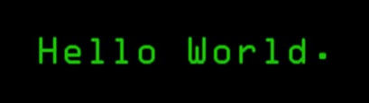

# 

  
  
  

 

<h2 align="center"> <em>About me</em></h2>

 

  Hey — I'm <em><b>Arman</b></em>, a proficient Front-End Developer focused on performance, scalability, and clean UX.
  I architect modern web apps with <b>React</b>, <b>Next.js</b>, and <b>TypeScript</b>, pushing <b>SSR</b>, <b>Suspense</b>,
  <b>streaming</b>, and <b>code splitting</b> to make interfaces feel instant and resilient.

      <em><b> Performance-first architecture for large-scale apps </b></em>  
      <em><b> Mentoring and leading front-end teams </b></em> 
        <em><b> CI/CD with GitHub Actions for reliable delivery </b></em> 

 
 

<h2 align="center"> <em>Technologies</em></h2>

  
  
  
  
  

 
 

<h2 align="center"> <em>Statistics</em></h2>

  
    
  

